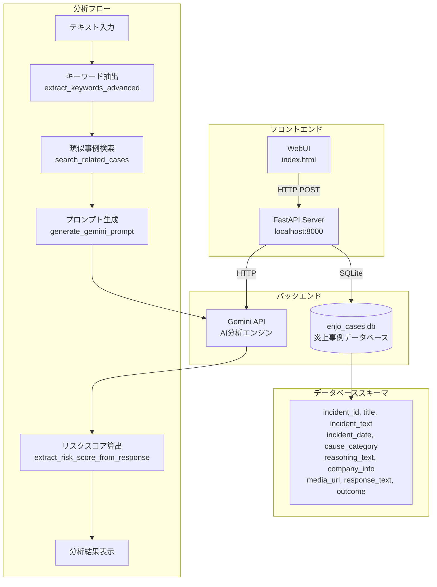
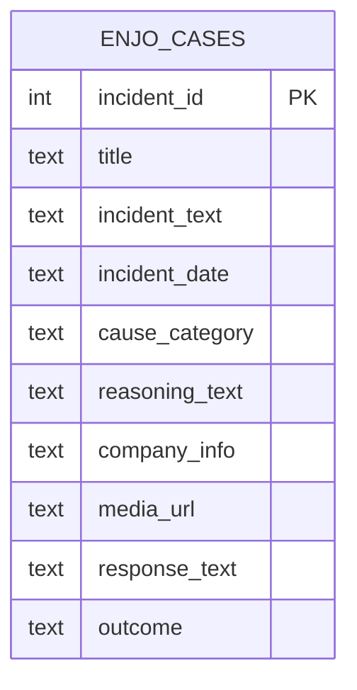
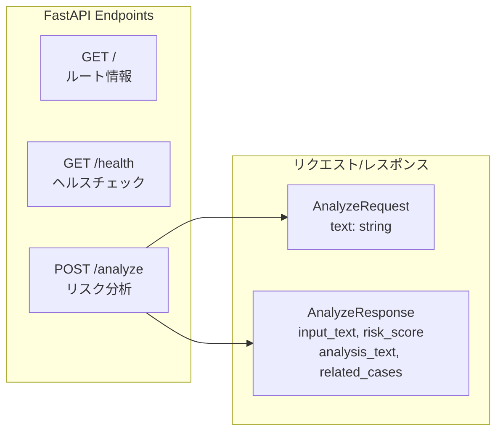
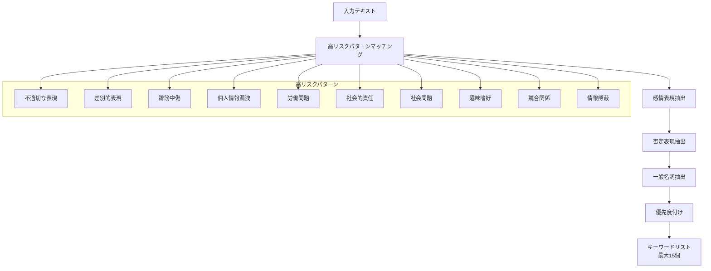
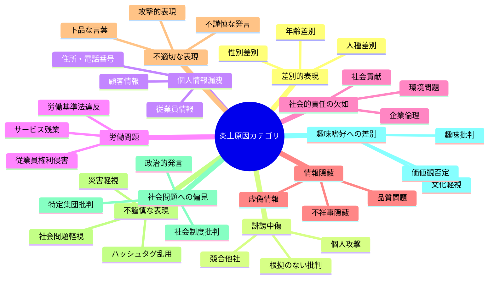
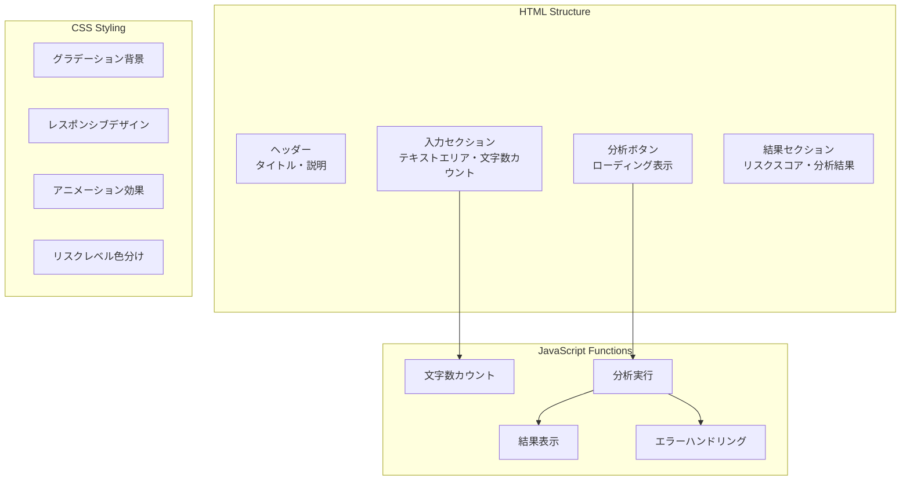
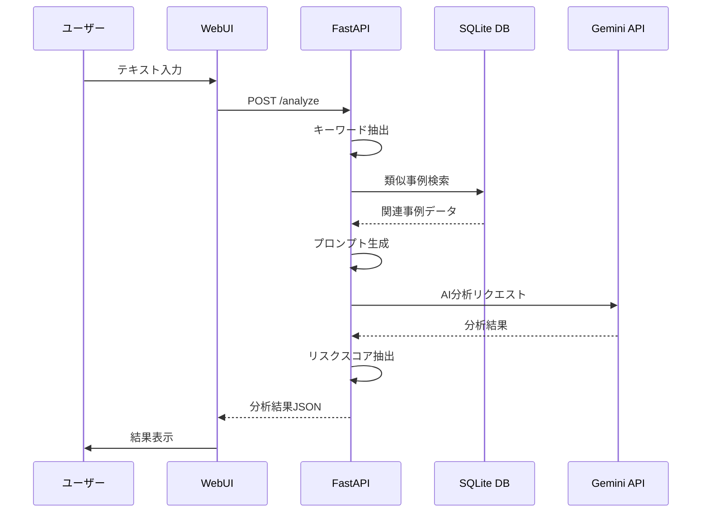
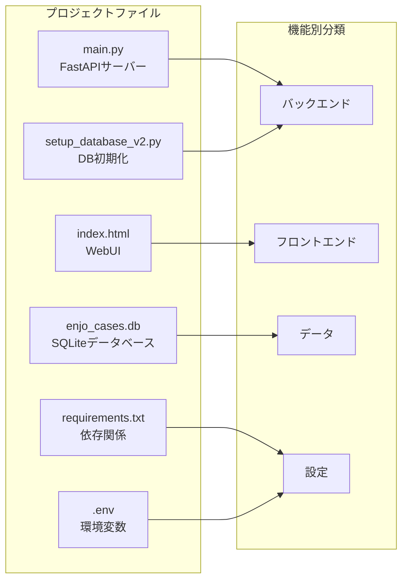
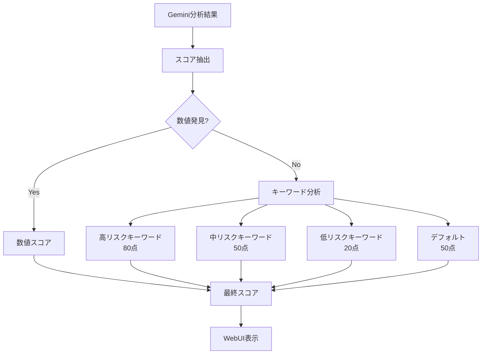
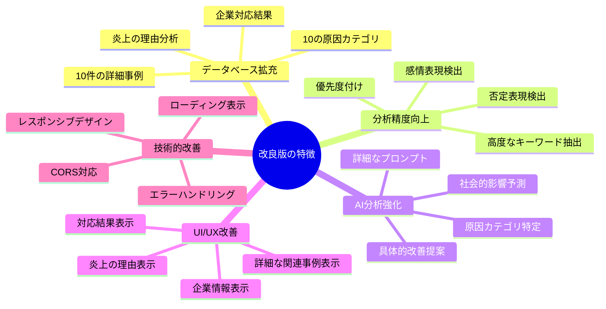

# 炎上リスク分析ツール システム構成図

## システム全体構成

```mermaid
graph TB
    subgraph "フロントエンド"
        UI[WebUI<br/>index.html]
        UI --> |HTTP POST| API[FastAPI Server<br/>localhost:8000]
    end
    
    subgraph "バックエンド"
        API --> |SQLite| DB[(enjo_cases.db<br/>炎上事例データベース)]
        API --> |HTTP| GEMINI[Gemini API<br/>AI分析エンジン]
    end
    
    subgraph "データベーススキーマ"
        DB --> SCHEMA[incident_id, title, incident_text<br/>incident_date, cause_category<br/>reasoning_text, company_info<br/>media_url, response_text, outcome]
    end
    
    subgraph "分析フロー"
        INPUT[テキスト入力] --> EXTRACT[キーワード抽出<br/>extract_keywords_advanced]
        EXTRACT --> SEARCH[類似事例検索<br/>search_related_cases]
        SEARCH --> PROMPT[プロンプト生成<br/>generate_gemini_prompt]
        PROMPT --> GEMINI
        GEMINI --> SCORE[リスクスコア算出<br/>extract_risk_score_from_response]
        SCORE --> OUTPUT[分析結果表示]
    end
```

## データベース構成

```mermaid
erDiagram
    ENJO_CASES {
        int incident_id PK
        text title
        text incident_text
        text incident_date
        text cause_category
        text reasoning_text
        text company_info
        text media_url
        text response_text
        text outcome
    }
```

## API エンドポイント構成

```mermaid
graph LR
    subgraph "FastAPI Endpoints"
        ROOT[GET /<br/>ルート情報]
        HEALTH[GET /health<br/>ヘルスチェック]
        ANALYZE[POST /analyze<br/>リスク分析]
    end
    
    subgraph "リクエスト/レスポンス"
        REQ[AnalyzeRequest<br/>text: string]
        RES[AnalyzeResponse<br/>input_text, risk_score<br/>analysis_text, related_cases]
    end
    
    ANALYZE --> REQ
    ANALYZE --> RES
```

## キーワード抽出アルゴリズム

```mermaid
flowchart TD
    INPUT[入力テキスト] --> PATTERN[高リスクパターンマッチング]
    PATTERN --> EMOTION[感情表現抽出]
    EMOTION --> NEGATION[否定表現抽出]
    NEGATION --> NOUN[一般名詞抽出]
    NOUN --> PRIORITY[優先度付け]
    PRIORITY --> OUTPUT[キーワードリスト<br/>最大15個]
    
    subgraph "高リスクパターン"
        P1[不適切な表現]
        P2[差別的表現]
        P3[誹謗中傷]
        P4[個人情報漏洩]
        P5[労働問題]
        P6[社会的責任]
        P7[社会問題]
        P8[趣味嗜好]
        P9[競合関係]
        P10[情報隠蔽]
    end
    
    PATTERN --> P1
    PATTERN --> P2
    PATTERN --> P3
    PATTERN --> P4
    PATTERN --> P5
    PATTERN --> P6
    PATTERN --> P7
    PATTERN --> P8
    PATTERN --> P9
    PATTERN --> P10
```

## 原因カテゴリ分類

```mermaid
mindmap
  root((炎上原因カテゴリ))
    差別的表現
      性別差別
      人種差別
      年齢差別
    誹謗中傷
      競合他社
      個人攻撃
      根拠のない批判
    個人情報漏洩
      顧客情報
      従業員情報
      住所・電話番号
    労働問題
      サービス残業
      労働基準法違反
      従業員権利侵害
    社会的責任の欠如
      環境問題
      社会貢献
      企業倫理
    情報隠蔽
      品質問題
      不祥事隠蔽
      虚偽情報
    不適切な表現
      下品な言葉
      攻撃的表現
      不謹慎な発言
    不謹慎な表現
      災害軽視
      社会問題軽視
      ハッシュタグ乱用
    社会問題への偏見
      政治的発言
      社会制度批判
      特定集団批判
    趣味嗜好への差別
      文化軽視
      趣味批判
      価値観否定
```

## WebUI コンポーネント構成

```mermaid
graph TB
    subgraph "HTML Structure"
        HEADER[ヘッダー<br/>タイトル・説明]
        INPUT[入力セクション<br/>テキストエリア・文字数カウント]
        BUTTON[分析ボタン<br/>ローディング表示]
        RESULT[結果セクション<br/>リスクスコア・分析結果]
    end
    
    subgraph "JavaScript Functions"
        CHARCOUNT[文字数カウント]
        ANALYZE[分析実行]
        DISPLAY[結果表示]
        ERROR[エラーハンドリング]
    end
    
    subgraph "CSS Styling"
        GRADIENT[グラデーション背景]
        RESPONSIVE[レスポンシブデザイン]
        ANIMATION[アニメーション効果]
        COLORS[リスクレベル色分け]
    end
    
    INPUT --> CHARCOUNT
    BUTTON --> ANALYZE
    ANALYZE --> DISPLAY
    ANALYZE --> ERROR
```

## 分析フロー詳細

```mermaid
sequenceDiagram
    participant U as ユーザー
    participant W as WebUI
    participant A as FastAPI
    participant D as SQLite DB
    participant G as Gemini API
    
    U->>W: テキスト入力
    W->>A: POST /analyze
    A->>A: キーワード抽出
    A->>D: 類似事例検索
    D-->>A: 関連事例データ
    A->>A: プロンプト生成
    A->>G: AI分析リクエスト
    G-->>A: 分析結果
    A->>A: リスクスコア抽出
    A-->>W: 分析結果JSON
    W->>U: 結果表示
```

## ファイル構成

```mermaid
graph LR
    subgraph "プロジェクトファイル"
        MAIN[main.py<br/>FastAPIサーバー]
        SETUP[setup_database_v2.py<br/>DB初期化]
        HTML[index.html<br/>WebUI]
        REQ[requirements.txt<br/>依存関係]
        ENV[.env<br/>環境変数]
        DB_FILE[enjo_cases.db<br/>SQLiteデータベース]
    end
    
    subgraph "機能別分類"
        BACKEND[バックエンド]
        FRONTEND[フロントエンド]
        DATA[データ]
        CONFIG[設定]
    end
    
    MAIN --> BACKEND
    SETUP --> BACKEND
    HTML --> FRONTEND
    REQ --> CONFIG
    ENV --> CONFIG
    DB_FILE --> DATA
```

## リスクスコア算出ロジック

```mermaid
flowchart TD
    START[Gemini分析結果] --> EXTRACT[スコア抽出]
    EXTRACT --> CHECK{数値発見?}
    CHECK -->|Yes| NUMERIC[数値スコア]
    CHECK -->|No| KEYWORD[キーワード分析]
    
    KEYWORD --> HIGH[高リスクキーワード<br/>80点]
    KEYWORD --> MEDIUM[中リスクキーワード<br/>50点]
    KEYWORD --> LOW[低リスクキーワード<br/>20点]
    KEYWORD --> DEFAULT[デフォルト<br/>50点]
    
    NUMERIC --> OUTPUT[最終スコア]
    HIGH --> OUTPUT
    MEDIUM --> OUTPUT
    LOW --> OUTPUT
    DEFAULT --> OUTPUT
    
    OUTPUT --> DISPLAY[WebUI表示]
```

## 改良版の特徴

```mermaid
mindmap
  root((改良版の特徴))
    データベース拡充
      10件の詳細事例
      10の原因カテゴリ
      炎上の理由分析
      企業対応結果
    分析精度向上
      高度なキーワード抽出
      優先度付け
      感情表現検出
      否定表現検出
    AI分析強化
      詳細なプロンプト
      原因カテゴリ特定
      社会的影響予測
      具体的改善提案
    UI/UX改善
      詳細な関連事例表示
      炎上の理由表示
      企業情報表示
      対応結果表示
    技術的改善
      CORS対応
      エラーハンドリング
      レスポンシブデザイン
      ローディング表示
```
